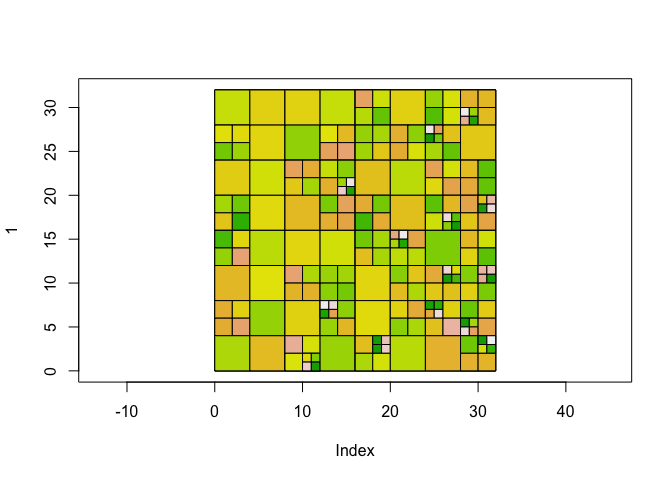
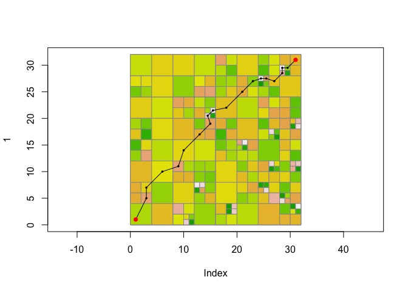

<!-- README.md is generated from README.Rmd. Please edit that file -->

# quadtree

## Installation

The package can be installed with the following R command:

``` r
devtools::install_gitlab("dafriend/quadtree")
```

## Example

A quadtree object is created from a ‘raster’ object:

``` r
library(quadtree)
library(raster)
#> Loading required package: sp
#create raster of random values
nrow = 32
ncol = 32
set.seed(1)
rast = raster(matrix(runif(nrow*ncol), nrow=nrow, ncol=ncol), xmn=0, xmx=ncol, ymn=0, ymx=nrow)

#create quadtree using the 'expand' method
qt = qt_create(rast, range_limit = .9) 
qt_plot(qt) #plot the quadtree
```



Cell values can be extracted:

``` r
qt_extract(qt,cbind(c(1,10,30),c(15,3,17)))
#> [1] 0.7836425 0.5221430 0.3244501
```

Least cost paths can be calculated:

``` r
start_point = c(1,1)
end_point = c(31,31)
lcp_finder = qt_lcp_finder(qt, start_point)
lcp = qt_find_lcp(lcp_finder, end_point, use_original_end_points = TRUE)
qt_plot(qt, border_col="gray60")
lines(lcp)
points(lcp, pch=16, cex=.5)
points(rbind(start_point, end_point), col="red", pch=16)
```


