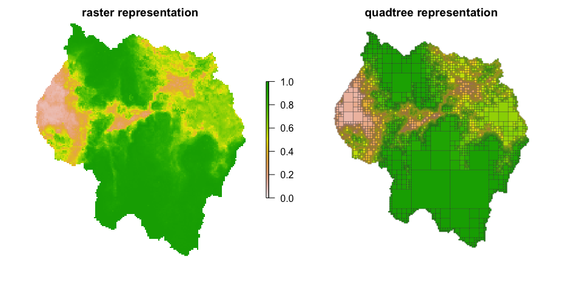

<!-- README.md is generated from README.Rmd. Please edit that file -->

# `quadtree`: An R package for region quadtrees

<!-- badges: start -->

[](https://cran.r-project.org/package=quadtree)
[](https://github.com/dfriend21/quadtree)
<!-- badges: end -->

`quadtree` provides functionality for working with raster-like quadtrees
(called “region quadtrees”), which allow for variable-sized cells.

``` r
library(quadtree)

data(habitat, package = "quadtree") # load sample data
qt <- quadtree(habitat, .03, "sd") # create a quadtree
```



## Installation

The package can be installed from CRAN using `install.packages()`:

``` r
install.packages("quadtree")
```

The development version can be installed from GitHub using
`devtools::install_github()`:

``` r
# install.packages("devtools")
devtools::install_github("dfriend21/quadtree")
```

## Documentation

Visit the [package
website](https://dfriend21.github.io/quadtree/index.html) for more
information.

## Learning how to use the `quadtree` package

The best way to learn about the package is by reading the vignettes,
which are available through R and through the [package
website](https://dfriend21.github.io/quadtree/index.html). I’d suggest
reading the vignettes in this order:

1.  [Creating
    Quadtrees](https://dfriend21.github.io/quadtree/articles/quadtree-creation.html)
2.  [Using
    Quadtrees](https://dfriend21.github.io/quadtree/articles/quadtree-usage.html)
3.  [Finding
    LCPs](https://dfriend21.github.io/quadtree/articles/quadtree-lcp.html)
