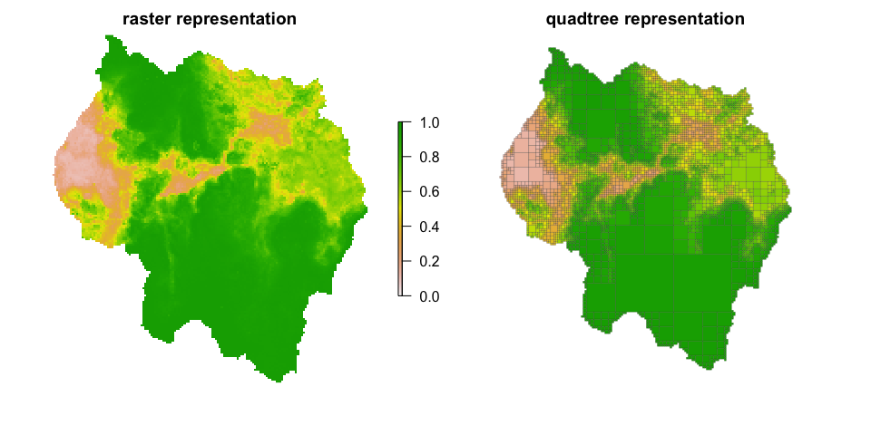

<!-- README.md is generated from README.Rmd. Please edit that file -->

# quadtree

This package provides functionality for working with raster-like
quadtrees, which allow for variable-sized cells.

## Installation

The package can be installed with the following R command:

``` r
devtools::install_gitlab("dafriend/quadtree")
```

For documentation of all the functions, see the PDF file stored at the
root directory.

## Example

A quadtree object is created from a raster or matrix:

``` r
library(quadtree)
library(sp)
library(raster)
#> 
#> Attaching package: 'raster'
#> The following objects are masked from 'package:quadtree':
#> 
#>     projection, projection<-

data(habitat, package="quadtree") #load sample data
qt = quadtree(habitat, split_threshold=.03, split_method="sd") #create a quadtree

par(mfrow=c(1,2), mar=c(3,2,2,2))
plot(habitat, zlim=c(0,1), main="raster representation", axes=FALSE, box=FALSE)
plot(qt, crop=TRUE, na_col=NULL, border_lwd=.2,xlab="", ylab="", legend=FALSE, zlim=c(0,1), main="quadtree representation", axes=FALSE)
```



The package allows for flexibility in the quadtree creation process.
Several functions defining how to split and aggregate cells are
provided, and custom functions can be written for both of these
processes. In addition, quadtrees can be created using other quadtrees
as “templates”, so that the new quadtree has the identical structure as
the template quadtree.

Once created, cell values can be extracted, as with a raster:

``` r
pts = cbind(c(20000,32000,5000),c(10000,30000,27000))
extract(qt,pts)
#> [1] 0.9692383 0.5340000 0.1364531
```

In addition, functions are provided for calculating least-cost paths
using the quadtree as a resistance surface.

``` r
start_point = c(6989,34007)
end_point = c(33015,38162)
lcp_finder = lcp_finder(qt, start_point)
lcp = find_lcp(lcp_finder, end_point, use_original_end_points = TRUE)

plot(qt, border_col="gray70", crop=TRUE, na_col=NULL, border_lwd=.5)
lines(lcp[,1:2])
points(rbind(start_point, end_point), col="red", pch=16)
```


## Learning how to use the `quadtree` package

Currently there are no vignettes, as this package is still in
development, although in the future I hope to add some. However, all of
the functions in the package are well documented and have extensive
examples that the user can run. To understand the basics of the library,
I’d recommend first reading the documentation for `quadtree` (i.e. run
`?quadtree` in the console) first - this help file contains all the
basic info on what a quadtree is and how it is constructed. To learn
more about the least-cost path functionality, start with the
documentation for `?lcp_finder` and also take a look at `?find_lcp` and
`?find_lcps`.

Most of the other functions are quite simple - take a look at the PDF
manual included in the repository for information on how to use them.

## File structure

The code here *mostly* conforms to the standard R package structure. The
exception is the ‘other\_files’ folder.

-   /R - contains the R files
-   /data - contains Rdata files (.rda) containing sample data
-   /man - contains the documentation files
-   /other\_files - contains ‘scratchwork’ scripts that I use to test
    the package functionality. This folder is ignored when the package
    is built.
-   /src - contains the C++ code
-   /tests - contains unit tests

## Implementation Details

The bulk of the code is written in C++ and interfaced with R via Rcpp.

The overall design philosophy was to keep the core C++ code completely
independent from the R code (i.e. no Rcpp-related code in the core C++
files.) This results in a three-tiered organization of the code - core
C++ code, Rcpp C++ code, and R code.

### Core C++ code

This consists of the following files (only the .h files are listed to
avoid redundancy, but each of these files has a corresponding .cpp
file):

-   Matrix.h - Defines the Matrix class implementing basic matrix
    funcitonality
-   Node.h - Defines the Node class, which are the ‘nodes’ of the
    quadtree
-   Point.h - Defines a simple Point class
-   PointUtilities.h - Defines a namespace containing functions for
    performing calculations with Point objects
-   Quadtree.h - Defines the Quadtree class, which can be seen as a
    wrapper that provides a link to the interconnected nodes that make
    up the quadtree
-   ShortestPathFinder.h - Defines a class for finding the least-cost
    paths using a quadtree as a cost surface

As mentioned before, these files are completely independent of R and can
be built and run independently of R.

### Rcpp C++ code

These files are called ‘wrappers’ - essentially they each contain an
instance of the relevant object and provide additional Rcpp-related
functions that can be accessed from R. These essentially provide the
“bridge” that allows the functionality in the core C++ files to be
accessed from R.

-   NodeWrapper.h - wrapper class for ‘Node’. This class is exposed to R
    as ‘CppNode’.
-   QuadtreeWrapper.h - wrapper class for ‘Quadtree’. This class is
    exposed to R as ‘CppQuadtree’.
-   ShortestPathFinderWrapper.h - wrapper class for
    ‘ShortestPathFinder’. This class is exposed to R as
    ‘CppShortestPathFinder’.
-   R\_Interface.h - defines a namespace that currently contains only a
    single function, which converts an Rcpp matrix to the Matrix class I
    created. This function is separate from the other files because it
    is a general-purpose function and thus didn’t fit in any of the
    wrapper classes.
-   load\_modules.cpp - contains code that exposes the wrapper classes
    to R using Rcpp modules.

### R code

Almost all of the core functionality of the quadtree package is
contained in the C++ code, and the R code serves primarily as an
interface for working with the C++ quadtree data structure. A Quadtree
S4 class is defined which consists only of one slot, which contains a
‘CppQuadtree’ object. The methods for this class are often quite simple,
merely consisting of calling one of the methods on the CppQuadtree
object. Using this approach has a few benefits. First, wrapping the C++
class in an S4 class allows the quadtree functionality to be accessed in
a way that is much more consistent with typical R syntax, which will
hopefully be more intuitive to R users. Second, it allows for me to add
R code to validate and make any necessary modifications to parameters
before calling the C++ methods - this helps make the functions more
robust. This also allows me to take advantage of existing R
functionality (for example, resampling a raster from the ‘raster’
package).

I won’t discuss each R file/function here - see the documentation PDF
for details on each R function.
